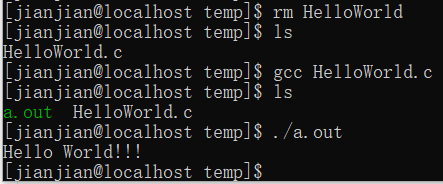

# C
- [编程风格](#编程风格)
- [HelloWorld](#HelloWorld)
- [基础](#基础)
  * [注释](#注释)
  * [标识符](#标识符)
  * [关键字](#关键字)
  * [基础数据类型](#基础数据类型)
  * [运算符](#运算符)
## 编程风格
Google C++编程规范 [文档](https://google.github.io/styleguide/cppguide.html)

[中文](GoogleC++StyleGuide.md)
## HelloWorld

```C
#include<stdio.h>
int main(){
  printf("Hello World!!!\n");
  return 0;
}
```

源文件：[HelloWorld.c](source/HelloWorld.c)

运行结果：



## 基础
### 注释
单行注释：`//注释内容`

多行注释：`/*注释内容*/`
### 标识符
字母或下划线`_`开始,后跟字母、下划线和数字。
### 关键字
[Microsoft Docs](https://docs.microsoft.com/zh-cn/cpp/c-language/c-keywords)
### 基础数据类型
|type|CentOS7_64|Win10_64|range|
|:-:|:-:|:-:|:-:|
|char|1|1||
|shorrt|2|2||
|int|4|4||
|long|8|4||
|long long|8|8||
|float|4|4||
|double|8|8||
|long double|16|8|

源文件：[DataTypes.c](source/DataTypes.c)
### 运算符
### 

## 

## 

## 
