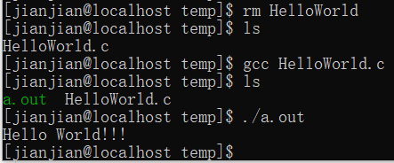

# C
- [编程风格](#编程风格)
- [HelloWorld](#HelloWorld)
- [基础](#基础)
  * [注释](#注释)
  * [标识符](#标识符)
  * [关键字](#关键字)
  * [基础数据类型](#基础数据类型)
  * [字符串](#字符串)
  * [结构体](#结构体)
  * [运算符](#运算符)
  * [流程控制](#流程控制)

## 编程风格
Google C++编程规范 [文档](https://google.github.io/styleguide/cppguide.html)

[中文](GoogleC++StyleGuide.md)
## HelloWorld

```C
#include<stdio.h>
int main(){
  printf("Hello World!!!\n");
  return 0;
}
```

源文件：[HelloWorld.c](source/HelloWorld.c)

运行结果：



## 基础
### 注释
单行注释：`//注释内容`

多行注释：`/*注释内容*/`
### 标识符
字母或下划线`_`开始,后跟字母、下划线和数字。
### 关键字
[Microsoft Docs](https://docs.microsoft.com/zh-cn/cpp/c-language/c-keywords)
### 基础数据类型
|type|CentOS7_64|Win10_64|range|
|:-:|:-:|:-:|:-:|
|char|1|1||
|shorrt|2|2||
|int|4|4||
|long|8|4||
|long long|8|8||
|float|4|4||
|double|8|8||
|long double|16|8|

源文件：[DataTypes.c](source/DataTypes.c)

### 字符串
字符数组，无`string`关键字

|函数|功能|
|:-:|:-:|
|strlen|字符串长度|
|strchr|字符位置|
|strstr|字符串位置|
|strcpy|字符串复制|
|strcat|字符串连接|
|strcmp|字符串比较|
### 结构体
```C
struct sturct_name{
  //item;
};
```

位域：在结构内的变量，可以定义宽度

```C
struct bit8{
  int byte1:8;
};
```

代码：[Struct.c](source/Struct.c)

结果：


### 运算符
算术运算符：`+ - * / % ++ --`

关系运算符：`== != > < >= <=`

逻辑运算符：`&& || ！`

位运算符：`& | ^ ~ >> <<`

赋值运算符：`= += -= *= /= %= <<= >>= &= |= ^=`

其他运算符：`sizeof() & * ?:`
### 流程控制
分支：if else switch

循环：for while do...while

循环控制语句：break continue (goto)


## 

## 
