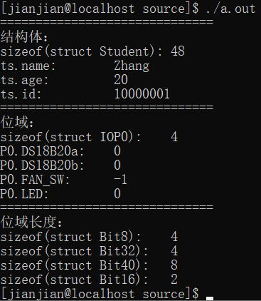
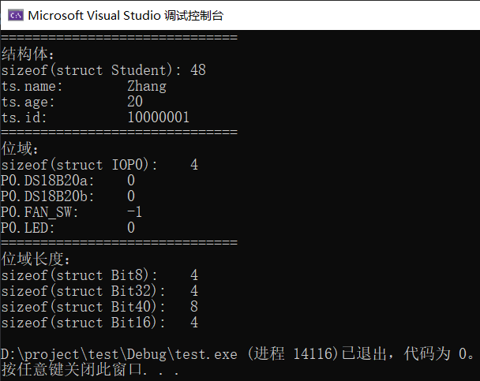

# C
- [准备工作](#准备工作)
- [编程风格](#编程风格)
- [HelloWorld](#HelloWorld)
- [基础](#基础)
  * [注释](#注释)
  * [标识符](#标识符)
  * [关键字](#关键字)
  * [基础数据类型](#基础数据类型)
  * [字符串](#字符串)
  * [结构体](#结构体)
  * [运算符](#运算符)
  * [流程控制](#流程控制)
- [进阶](#进阶)
  * [指针](#指针)
  * [函数](#函数)
  * [内存管理](#内存管理)
- [标准库](#标准库)
  * [stdlib.h](#stdlib_h)
  * [stdio.h](#stdio_h)
  * [string.h](#string_h)
  * [math.h](#math_h)
  * [time.h](#time_h)

## 准备工作
修改系统编码
Win10：设置 -> 时间和语言 -> 日期、时间和区域格式设置 -> 其他日期、时间和区域设置 -> 区域 -> 管理 -> 更改系统区域设置 -> 勾选【使用Unicode UTF-8提供全球语言支持】 确认，重启

VS2019:

工具 -> 选项 -> 文本编辑器 -> C/C++ -> 制表符 -> 选项卡 -> 选择 插入空格，修改缩进大小2

工具 -> 自定义 -> 命令 -> 菜单栏 -> 文件 -> 添加命令 -> 文件 -> 高级保存选项 -> 确定 -> 
## 编程风格
Google C++编程规范 [文档](https://google.github.io/styleguide/cppguide.html)

[中文](GoogleC++StyleGuide.md)
## HelloWorld

```C
#include<stdio.h>
int main(){
  printf("Hello World!!!\n");
  return 0;
}
```

源文件：[HelloWorld.c](source/HelloWorld.c)

运行结果：


## 基础
### 注释
单行注释：`//注释内容`

多行注释：`/*注释内容*/`
### 标识符
字母或下划线`_`开始,后跟字母、下划线和数字。
### 关键字
[Microsoft Docs](https://docs.microsoft.com/zh-cn/cpp/c-language/c-keywords)
### 基础数据类型
|type|CentOS7_64|Win10_64|range|
|:-:|:-:|:-:|:-:|
|char|1|1|CHAR_MIN ~ CHAR_MAX|
|shorrt|2|2|SHRT_MIN ~ SHRT_MAX|
|int|4|4|INT_MIN ~ INT_MAX|
|long|8|4|LONG_MIN ~ LONG_MAX|
|long long|8|8|LLONG_MIN ~ LLONG_MAX|
|float|4|4|FLT_MIN ~ FLT_MAX|
|double|8|8|DBL_MIN ~ DBL_MAX|
|long double|16|8|LDBL_MIN ~ LDBL_MAX|

源文件：[DataTypes.c](source/DataTypes.c)

### 字符串
字符数组，无`string`关键字

|函数|功能|
|:-:|:-:|
|strlen|字符串长度|
|strchr|字符位置|
|strstr|字符串位置|
|strcpy|字符串复制|
|strcat|字符串连接|
|strcmp|字符串比较|
### 结构体
```C
struct sturct_name{
  //item;
};
```

位域：在结构内的变量，可以定义宽度

```C
struct bit8{
  int byte1:8;
};
```

代码：[Struct.c](source/Struct.c)

结果：




### 运算符
算术运算符：`+ - * / % ++ --`

关系运算符：`== != > < >= <=`

逻辑运算符：`&& || ！`

位运算符：`& | ^ ~ >> <<`

赋值运算符：`= += -= *= /= %= <<= >>= &= |= ^=`

其他运算符：`sizeof() & * ?:`
### 流程控制
分支：if else switch

循环：for while do...while

循环控制语句：break continue (goto)

## 进阶
### 指针
运算符：取地址运算符`&` 解引用运算符`*`
### 函数
```
[返回值类型] [函数名](参数列表){
  [函数操作]
}
```
### 内存管理
头文件：stdlib.h

|函数|作用|返回值|
|:-:|:-:|:-:|
|`void* calloc(int count, int size);`|动态地分配 num 个长度为 size 的连续内存空间，并初始化为 0|成功返回分配的内存空间首地址，失败返回空指针|
|`void free(void* block);`|释放动态分配的内存空间||
|`void* malloc(int size);`|动态地分配 size 个字节长度的内存空间，不进行初始化|成功返回分配的内存空间首地址，失败返回空指针|
|`void* realloc(void* block, int newsize);`|调整动态分配的内存空间大小为 size 个字节长度|成功返回分配的内存空间首地址并自动释放原内存空间，失败返回空指针并保留原内存空间|

代码：[More.c](source/More.c)

## 标准库
### stdlib_h

### stdio_h

### string_h

字符串(字符数组)操作

|函数|作用|返回值|备注|
|:-:|:-:|:-:|:-:|
|`char* strcpy(char* destination,const char* source);`|复制字符串|目标字符串地址|
|`char* strncpy(char* destination,const char* source,size_t num);`|复制指定长度字符串/字符数组|目标字符串地址|
|`char* strcat (char* destination,const char* source);`|连接字符串|目标字符串地址|
|`char* strncat (char* destination,const char* source,size_t num);`|连接指定长度字符串|目标字符串地址|
|`int strncmp(const char* str1,const char* str2,size_t num);`|比较字符串|`0:相同 <0:str1<str2 >0:str1>str2`|
|`int strncmp(const char* str1,const char* str2,size_t num);`|比较指定长度字符串|同上|
|`char* strtok(char* str,const char* delimiters);`|分割字符串|每次分割出字符串地址|除第一次外,str使用参数NULL|
|`char* strrchr(const char* str,int character);`|查找字符|出现的最后一个字符的地址|
|`char* strstr(const char* str1,const char* str2);`|查找字符串|出现的最后一个字符的地址|
|`size_t strlen(const char* str);`|获得字符串长度|字符串长度|
|`char* strerror(int errnum);`|获得错误字符串|错误字符串地址|

代码：[Stringh.c](source/Stringh.c)

### math_h

### time_h
