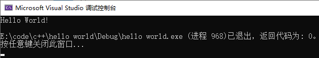
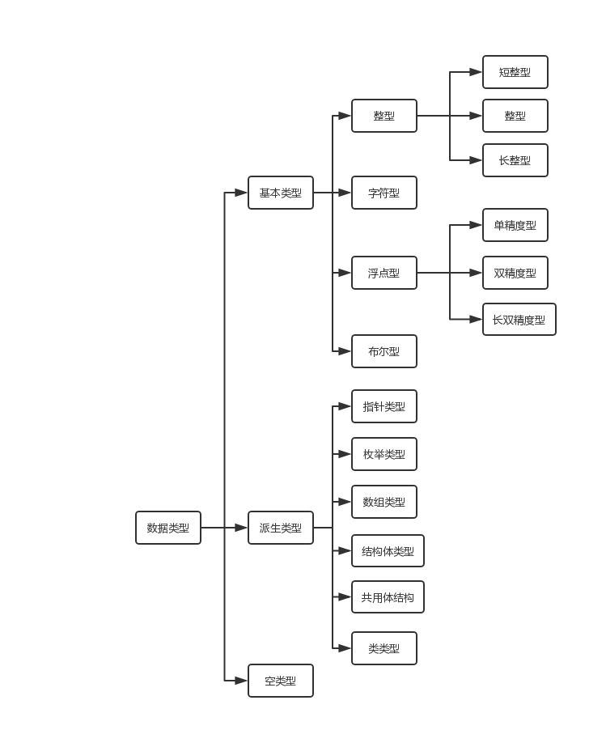
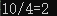
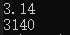

# CPP基础
* [HelloWorld](#HelloWorld)
* [代码风格](#代码风格)
* [基础数据类型](#基础数据类型)
* [运算符](#运算符)
* [指针](#指针)
* [字符串](#字符串)
* [控制语句](#控制语句)
* [函数](#函数)
* [输入输出](#输入输出)
* [面向对象](#面向对象)
## HelloWorld
```cpp
#include <iostream>
using namespace std;
int main()
{
    cout << "Hello World!"<<endl;
    return 0;
}
```



## 代码风格

## 基础数据类型



|类型名|关键字|字节|直接量|
|:-:|:-:|:-:|:-:|
|字符|char|1|''|
|短整型|short|2|
|整型|int|4|整数|
|长整型|long long|8|L(l)后缀|
|单精度浮点型|float|4|F(f)后缀|
|双精度浮点型|double|8|

无符号数

关键字：unsigned

直接量：u后缀

### 整型
```c++
#include <iostream>
using namespace std;
int main()
{
  int i = 4;
  long l=10L;
  cout<<l<<"/"<<i<<"="<<(l/i);
  return 0;
}
```

### 浮点型
```c++
#include <iostream>
using namespace std;
int main()
{
  float f = 3.14f;
  double d = 3.14e3;
  cout << f<<endl<<d;
  return 0;
}
```

### 布尔型
true(1) flase(0)
### 字符型
`char c= 'c';`

|转义字符|含义|
|:-:|:-:|
|\\'|'|
|\\"|"|
|\\\\ | \\ |
|\0|空字符|
|\a|响铃|
|\b|后退|
|\f|走纸|
|\n|换行|
|\r|回车|
|\t|制表符
|\v|垂直制表符|
|\xnnn|十六进制
## 运算符
### 自加自减运算符
`++ --`
### 算术运算符
`+ - * / %`
### 位运算符
`~ & | ^ << >>`
### 赋值运算符
`= += -= *= /= %= &= |= ^= <<= >>=`
### 比较运算符
`== != > >= < <=`
### 逻辑运算符
`! && ||`
### 字节数运算符
sizeof()
### 条件运算符
` ? : `
## 指针
### 定义
<类型>\*<变量名>

`int *p;`

指针变量命名：

>以 ‘p’ 或 ‘ptr’ 开头

>驼峰式 或 ‘_’
### 初始化
**变量：**

&：取地址符

```
int i;
int *pI = &i;
```
**分配空间**
new

```
char *p;
p = new char;
delete p;
```

malloc

```
type *p;
p=(type)malloc(sizeof(type)*n);
free p;
```
### 运算
+/-

地址移动sizeof(type)长度
### 使用
p：对指针地址使用
\*p：对指针指向地址存储的数据操作
## 字符串
### 定义
```
string s1 = "hello ";
string s2(s1);
string s3("world");
string s4(3,'!!!')
```
### 访问
下标访问：`s[1]='a';cout<<s[1];`
### 操作
[文档](http://www.cplusplus.com/reference/string/string/)

|函数|功能|
|:-:|:-:|
|size|返回长度|
|length|返回长度|
|max_size|返回字符串最长长度|
|capacity|返回分配空间长度|
|resize|修改字符串长度|
|clear|清空字符串|
|empty|判断是否为空|
|substr|提取|
|insert|插入|
|replace|替换|

## 控制语句
### 分支
if
```
if(ex1){
    //op;
}
else if(ex2){
    //op;
}
else{
    //op;
}
```
switch
```
switch(ex){
    case value1:
        //op;
        break;
    case value2:
        //op;
        break;
    default:
        //op;
        //break;
}
```
### 循环
结构：

for
```
for(;;){
    //op;
}
```
while
```
while(){
    //op;
}
```
do-while
```
do{
    //op;
}while();
```
语句：

break;  continue;  goto;  return;
## 函数
形参不改变实参的值

指针作为参数传递地址，改变值
## 输入输出
头文件`#include<iostream>`

cin：输入，以‘空格’ ‘回车’ ‘tab’ 分割

cout：输出，endl换行

getchar()：字节输入

## 面向对象
### 定义
```
class ClassName{
//成员(属性+方法);
private:    //私有属性
    static int count = 0;   //静态变量
public:     //公有方法
    ClassName();    //构造函数
    ~ClassName();    //析构函数
}
```
### 继承
|派生方式|public|protected|private|
|:-:|:-:|:-:|:-:|
|private|private|private|不可见|
|protected|protected|private|不可见|
|public|public|protected|不可见|

### 虚基类
解决多继承同一基类二义性问题

[TOP](#CPP基础)
