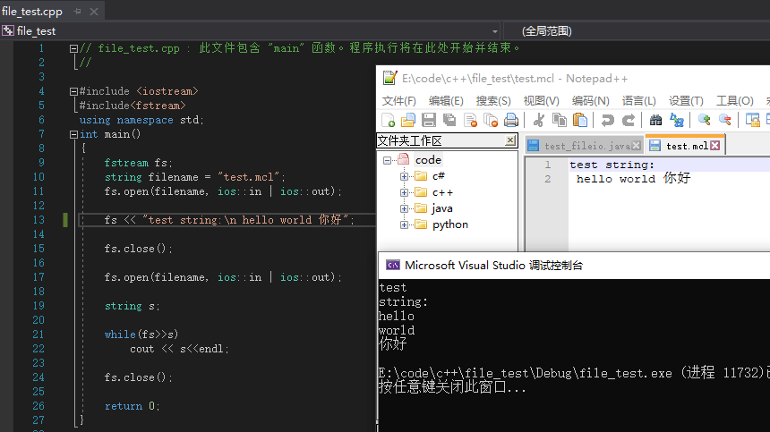

# 文件操作
顺序：打开文件->读/写->关闭

## 打开
void open (const char* filename,
           ios_base::openmode mode = ios_base::in | ios_base::out);
mode：

|值|含义|作用|
|:-:|:-:|:-:|
|in|input|打开文件-输入|
|out|output|打开文件-输出|
|binary|binary|二进制(binary)操作|
|ate|at end|文件输出开始于文件尾部|
|app|append|文件输出发生在文件尾部，添加到现有内容后|
|trunc|truncate|之前内容会丢失|

以 or 或 | 连接

## 读写
文件读取到内存`>>`
内存写入到文件`<<`
## 关闭
close();
## 程序
```
#include <iostream>
#include<fstream>
using namespace std;
int main()
{
    fstream fs;
    string filename = "test.mcl";
    fs.open(filename, ios::in | ios::out);
    fs << "test string:\n hello world 你好";
    fs.close();
    fs.open(filename, ios::in | ios::out);
    string s;
    while(fs>>s)
        cout << s<<endl;
    fs.close();
    return 0;
}
```


