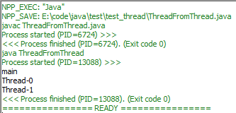
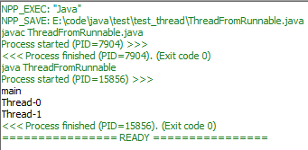

# 多线程
- [创建启动线程](#创建启动线程)
  * [继承Thread](#继承Thread)
  * [实现Runnable](#实现Runnable)
  * [使用Callable和Future](#使用Callable和Future)
- [线程控制](#线程控制)
  * [启动方式](#启动方式)
  * [调用方法](#调用方法)
  * [调整优先级](#调整优先级)
- [线程同步](#线程同步)
  * [同步代码块](#同步代码块)
  * [同步方法](#同步方法)
  * [同步锁](#同步锁)
- [线程通信](#线程通信)
  * [对同步方法](#对同步方法)
  * [对同步锁](#对同步锁)
  * [阻塞队列](#阻塞队列)
- [线程组](#线程组)
- [线程池](#线程池)

## 创建启动线程
### 继承Thread
```
public class ThreadFromThread extends Thread{
    public void run(){
        System.out.println(getName());
    }
    public static void main(String[] args){
        System.out.println(Thread.currentThread().getName());
        new ThreadFromThread().start();
        new ThreadFromThread().start();
    }
}
```


### 实现Runnable
```
public class ThreadFromRunnable implements Runnable{
    public void run(){
        System.out.println(Thread.currentThread().getName());
    }
    public static void main(String[] args){
        System.out.println(Thread.currentThread().getName());
        ThreadFromRunnable tfr = new ThreadFromRunnable();
        new Thread(tfr).start();
        new Thread(tfr).start();
    }
}
```


### 使用Callable和Future
## 线程控制
### 启动方式
1. 正常线程

使用`start()`启动

2. 后台线程

所有前台线程死亡时，后台线程随之死亡

使用`setDaemon(true)`设置为后台线程，使用`start()`启动

3. join线程

join方法调用的线程执行，调用线程被阻塞，知道join线程执行完毕

使用`join()`方法调用

### 调用方法
1. 线程睡眠：sleep

`static void sleep(long millis)`让正在执行的线程阻塞millis毫秒

2. 线程让步：yield

让正在执行的线程暂停，进入就绪队列，重新调度

### 调整优先级
使用方法`setPriority(int newPriority)`设置优先级

使用方法`getPriority()`返回优先级

MIN_PRIORITY:1 NORM_PRIORITY:5 MAX_PRIORITY:10

默认优先级：5
## 线程同步
### 同步代码块
```
synchronized(obj){

}
```
显式指定同步监视器：obj

测试代码：
```
public class Account{
    private int balance=5000;
    public int getbalance(){
        return balance;
    }
    public void setbalance(int newb){
        balance=newb;
    }
}
```

```
public class test_ThreadLock extends Thread{
    private Account account;
    private int draw;
    int name;
    test_ThreadLock(int n,Account acc,int d){
        this.account=acc;
        this.draw=d;
        this.name=n;
    }
    public void run(){
        if(account.getbalance()>=draw){
            account.setbalance(account.getbalance()-draw);
            System.out.println(name+"取款成功，余额："+account.getbalance());
        }
        else{
            System.out.println(name+"取款失败，余额："+account.getbalance());
        }
    }
    public static void main(String[] args){
        Account acc= new Account();
        for(int i=0;i<15;i++){
            new test_ThreadLock(i,acc,400).start();
        }
    }
}
```

```
public class test_ThreadLock extends Thread{
    private Account account;
    private int draw;
    int name;
    test_ThreadLock(int n,Account acc,int d){
        this.account=acc;
        this.draw=d;
        this.name=n;
    }
    public void run(){
        synchronized(account){
            if(account.getbalance()>=draw){
                account.setbalance(account.getbalance()-draw);
                System.out.println(name+"取款成功，余额："+account.getbalance());
            }
            else{
                System.out.println(name+"取款失败，余额："+account.getbalance());
            }
        }
    }
    public static void main(String[] args){
        Account acc= new Account();
        for(int i=0;i<15;i++){
            new test_ThreadLock(i,acc,400).start();
        }
    }
}
```

### 同步方法
使用`synchronized`关键字修饰方法

同步监视器为this：调用该同步方法方法的对象

```
public class Account{
    private int balance=5000;
    public void setbalance(int n,int newb){
        if(balance>=newb){
            balance-=newb;
            System.out.println(n+"取款成功，余额："+balance);
        }
        else{
            System.out.println(n+"取款失败，余额："+balance);
        }
    }
}
```

```
public class test_ThreadLock extends Thread{
    private Account account;
    private int draw;
    int name;
    test_ThreadLock(int n,Account acc,int d){
        this.account=acc;
        this.draw=d;
        this.name=n;
    }
    public void run(){
        account.setbalance(name,draw);
    }
    public static void main(String[] args){
        Account acc= new Account();
        for(int i=0;i<15;i++){
            new test_ThreadLock(i,acc,400).start();
        }
    }
}
```


```
public class Account{
    private int balance=5000;
    public synchronized void setbalance(int n,int newb){
        if(balance>=newb){
            balance-=newb;
            System.out.println(n+"取款成功，余额："+balance);
        }
        else{
            System.out.println(n+"取款失败，余额："+balance);
        }
    }
}
```


### 同步锁

```
import java.util.concurrent.locks.*;
public class Account{
    private ReentrantLock l = new ReentrantLock();
    private int balance=5000;
    public void setbalance(int n,int newb){
        l.lock();
        try{
            if(balance>=newb){
                balance-=newb;
                System.out.println(n+"取款成功，余额："+balance);
            }
            else{
                System.out.println(n+"取款失败，余额："+balance);
            }
        }
        finally{
            l.unlock();
        }
    }
}
```

```
public class test_ThreadLock extends Thread{
    private Account account;
    private int draw;
    int name;
    test_ThreadLock(int n,Account acc,int d){
        this.account=acc;
        this.draw=d;
        this.name=n;
    }
    public void run(){
        account.setbalance(name,draw);
    }
    public static void main(String[] args){
        Account acc= new Account();
        for(int i=0;i<15;i++){
            new test_ThreadLock(i,acc,400).start();
        }
    }
}
```


## 线程通信
### 对同步方法
|方法|功能|
|:-:|:-:|
|wait|线程等待|
|notify|唤醒单个线程|
|notifyAll|唤醒所有线程|

### 对同步锁
使用newCondition()得到Condition实例

通过Lock实例的Condition实例使用以下方法

|方法|功能|
|:-:|:-:|
|await|线程等待|
|signal|唤醒单个线程|
|notifyAll|唤醒所有线程|

### 阻塞队列

## 线程组
## 线程池

[TOP](#多线程)
