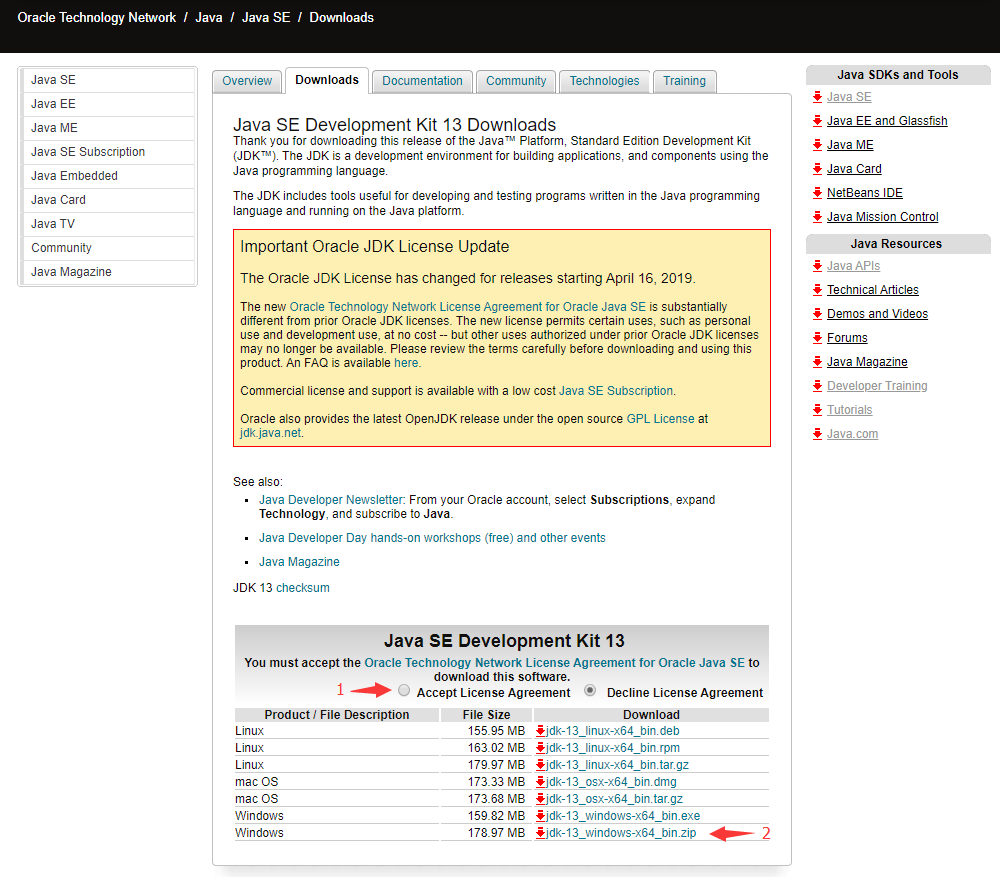
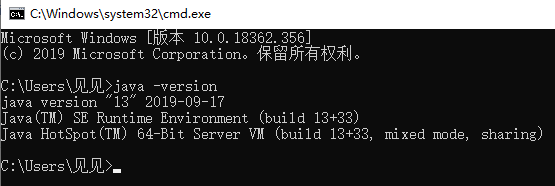

# Java环境安装
[Windows10安装Java环境](#Windows10安装Java环境)
    
* [安装环境 安装版](#安装环境-安装版)
  - [下载](#下载安装程序)
  - [安装](#安装环境)
  - [卸载](#卸载环境)
* [配置环境 解压版](#配置环境-解压版)
  - [下载](#压缩包下载)
  - [安装](#配置环境)
  - [卸载](#删除环境)

[notepad++运行Java设置](#npp运行Java设置)
## Windows10安装Java环境
### 安装环境-安装版
#### 下载安装程序
[Java官网](https://www.oracle.com/technetwork/java/javase/downloads/index.html)下载

选择Java SE相应版本下载

[java12](https://www.oracle.com/technetwork/java/javase/downloads/jdk12-downloads-5295953.html)

[java13](https://www.oracle.com/technetwork/java/javase/downloads/jdk13-downloads-5672538.html)

#### 安装环境

#### 卸载环境

### 配置环境-解压版
#### 压缩包下载
[Java官网](https://www.oracle.com/technetwork/java/javase/downloads/index.html)下载

选择Java SE相应版本下载

[java12](https://www.oracle.com/technetwork/java/javase/downloads/jdk12-downloads-5295953.html)

[java13](https://www.oracle.com/technetwork/java/javase/downloads/jdk13-downloads-5672538.html)

勾选同意协议，下载相应系统版本

#### 配置环境

###### 解压到电脑

为避免不必要的麻烦，尽量避免解压到C盘，避免含有中文路径

解压路径：D:\Java

Java路径：D:\Java\jdk-13

Java/bin：D:\Java\jdk-13\bin

###### 配置环境变量

右键**此电脑**->属性->高级系统设置->环境变量->系统变量中找到path->双击path或单击点编辑->新建->将java/bin路径粘贴

依次全部确定
###### 验证配置环境

win+R 打开cmd

输入java -version

如图：

#### 删除环境
直接删除解压的文件夹即可

# npp运行java设置

[TOP](#python环境安装)
