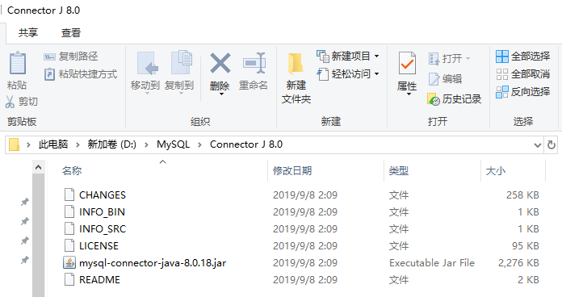
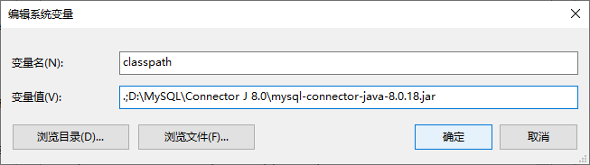
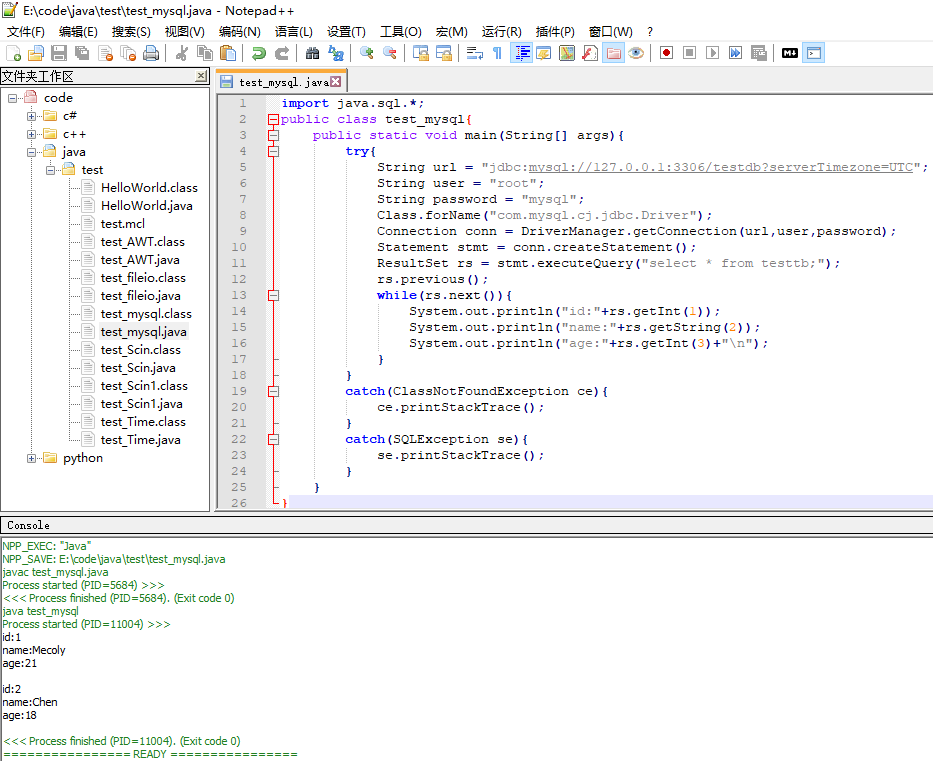

# 数据库
* [JDBC](#JDBC)
* [JDBC编程步骤](#JDBC编程步骤)
  - [jar包使用](#jar包使用)
  - [加载数据库驱动](#加载数据库驱动)
  - [获取数据库连接](#获取数据库连接)
  - [创建Statement对象](#创建Statement对象)
  - [使用Statement执行SQL语句](#使用Statement执行SQL语句)
  - [操作结果集](#操作结果集)
  - [回收数据库资源](#回收数据库资源)
* [实例](#实例)
## JDBC
JDBC(Java Database Connectivity):Java数据库连接

功能:
1. 创建与数据库的连接
2. 执行SQL语句
3. 获得SQL语句的执行结果
## JDBC编程步骤
### jar包使用
使用MySQL安装程序下载MySQL Connector/J 



设置环境变量classpath


### 加载数据库驱动
加载MySQL驱动

~~`Class.forName("com.mysql.jdbc.Driver");`~~
`Class.forName("com.mysql.cj.jdbc.Driver");`
### 获取数据库连接
`DriverManager.getConnection(url,user,pass);`

url(MySQL)：

`jdbc:mysql://hostname:port/databasename?serverTimezone=`
### 创建Statement对象
`createStatement();`
### 使用Statement执行SQL语句
|方法|功能|
|:-:|:-:|
|execute()|执行任何SQL语句|
|executeUpdate()|主要执行DML(对数据)和DDL(对表)语句|
|executeQuery()|查询语句,返回ResultSet对象|
### 操作结果集
移动指针

`next();previous();first();last();beforeFirst();afterLast();absolute();`

获取记录值

`getXxx();`
### 回收数据库资源

## 实例
```
import java.sql.*;
public class test_mysql{
    public static void main(String[] args){
        try{
            String url = "jdbc:mysql://127.0.0.1:3306/testdb?serverTimezone=UTC";
            String user = "root";
            String password = "mysql";
            Class.forName("com.mysql.cj.jdbc.Driver");
            Connection conn = DriverManager.getConnection(url,user,password);
            Statement stmt = conn.createStatement();
            ResultSet rs = stmt.executeQuery("select * from testtb;");
            rs.previous();
            while(rs.next()){
                System.out.println("id:"+rs.getInt(1));
                System.out.println("name:"+rs.getString(2));
                System.out.println("age:"+rs.getInt(3)+"\n");
            }
        }
        catch(ClassNotFoundException ce){
            ce.printStackTrace();
        }
        catch(SQLException se){
            se.printStackTrace();
        }
    }
}
```


