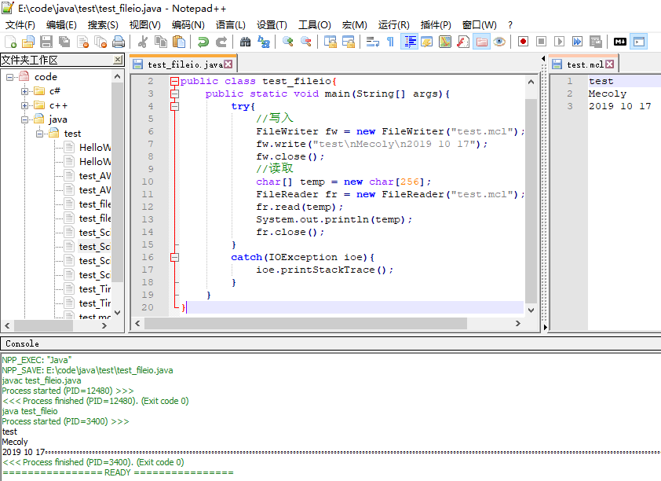

# 文件读写
* [文件操作](#文件)
* [输入](#输入)
* [输出](#输出)
* [java输入输出流分类](#java输入输出流分类)
* [程序](#程序)
## 文件

## 输入
### 字节流
InputStream

|方法|功能|
|:-:|:-:|
|int read()|读取单个字节|
|int read(byte\[] b)|读取b.length个字节到b中|
|int read(byte\[] b,int off,int len)|读取len个字节,从off开始,存储到b中|
### 字符流
Reader

|方法|功能|
|:-:|:-:|
|int read()|读取单个字符|
|int read(char\[] cbuf)|读取cbuf.length个字符到cbuf中|
|int read(char\[] cbuf,int off,int len)|读取len个字符,从off开始,存储到cbuf中|
## 输出
### 字节流
OutputStream

|方法|功能|
|:-:|:-:|
|int write(int c)|写入单个字节|
|int write(byte\[] b)|将b中字节数组的数据输出到指定输出流|
|int write(byte\[] b,int off,int len)|将b中,从off开始的len个字节,输出到指定输出流|
### 字符流
Reader

|方法|功能|
|:-:|:-:|
|int write(int c)|写入单个字节|
|int write(char\[] cbuf)|将cbuf中字符数组的数据输出到指定输出流|
|int write(char\[] cbuf,int off,int len)|将cbuf中,从off开始的len个字符,输出到指定输出流|
### 字符串
|方法|功能|
|:-:|:-:|
|void write(String str)|写入字符串|
|void write(String str,int off,int len)|将str中,从off开始的len个字符,输出到指定输出流|
## java输入输出流分类
|分类|字节输入流|字节输出流|字符输入流|字符输出流|
|:-:|:-:|:-:|:-:|:-:|
|抽象基类|InputStream|OutputStream|Reader|Writer|
|访问文件|FileInputStream|FileOutputStream|FileReader|FileWriter|
|访问数组|ByteArrayInputStream|ByteArrayOutputStream|CharArrayReader|CharArrayWriter|
|访问信道|PipedInputStream|PipedOutputStream|PipedReader|PipedWriter|
|访问字符串|||StringReader|StringWriter|
|缓冲流|BufferedInputStream|BufferedOutputStream|BufferedReader|BufferedWriter|
|转换流|||InputStreamReader|OutputStreamWriter|
|对象流|ObjectInputStream|ObjectOutputStream|||
|打印流||PrintStream||PrintWriter|
|推回输入流|PushbackInputStream||PushbackReader||
|特殊流|DataInputStream|DataOutputStream|||

## 程序
需要异常处理

```
import java.io.*;
public class test_fileio{
    public static void main(String[] args){
        try{
            //写入
            FileWriter fw = new FileWriter("test.mcl");
            fw.write("test\nMecoly\n2019 10 17");
            fw.close();
            //读取
            char[] temp = new char[256];
            FileReader fr = new FileReader("test.mcl");
            fr.read(temp);
            System.out.println(temp);
            fr.close();
        }
        catch(IOException ioe){
            ioe.printStackTrace();
        }
    }
}
```

