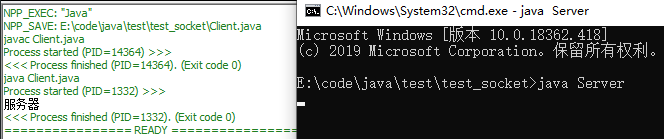
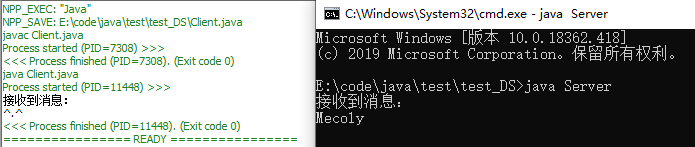

# 网络编程
引包`import java.net.*;`

* [基于TCP](#基于TCP)

* [基于UDP](#基于UDP)
  - [DatagramSocket](#DatagramSocket)
  - [MulticastSocket](#MulticastSocket)
## 基于TCP
服务器端
```
import java.io.*;
import java.net.*;
public class Server{
    public static void main(String[] args){
        int port = 7770;
        try{
            ServerSocket ss = new ServerSocket(port);
            while(true){
                Socket s = ss.accept();
                BufferedWriter bw = new BufferedWriter(new OutputStreamWriter(s.getOutputStream()));
                bw.write("服务器");
                bw.close();
                s.close();
            }
        }
        catch(IOException e){
            e.printStackTrace();
        }
    }
}
```
客户端
```
import java.io.*;
import java.net.*;
public class Client{
    public static void main(String[] args){
        String ip = "127.0.0.1";
        int port = 7770;
        try{
            Socket s = new Socket(ip,port);
            BufferedReader br = new BufferedReader(new InputStreamReader(s.getInputStream()));
            System.out.println(br.readLine());
            br.close();
            s.close();
        }
        catch(IOException e){
            e.printStackTrace();
        }
    }
}
```

## 基于UDP
### DatagramSocket
服务器端
```
import java.io.*;
import java.net.*;
public class Server{
    public static void main(String[] args){
        int port = 7770;
        byte[] rb = new byte[256];
        String ss = "^.^";
        byte[] sb = ss.getBytes();
        try{
            DatagramSocket ds = new DatagramSocket(port);
            DatagramPacket dpReceive = new DatagramPacket(rb,rb.length);
            while(true){
                ds.receive(dpReceive);
                System.out.println("接收到消息：");
                System.out.println(new String(rb,0,dpReceive.getLength()));
                DatagramPacket dpSend= new DatagramPacket(sb,sb.length,dpReceive.getSocketAddress());
                ds.send(dpSend);                
            }
        }
        catch(IOException e){
            e.printStackTrace();
        }
    }
}
```
客户端
```
import java.io.*;
import java.net.*;
public class Client{
    public static void main(String[] args){
        String ip = "127.0.0.1";
        int port = 7770;
        byte[] rb = new byte[256];
        try{
            
            DatagramSocket ds = new DatagramSocket();
            String ss = "Mecoly";
            byte[] sb = ss.getBytes();
            DatagramPacket dpSend= new DatagramPacket(sb,sb.length,InetAddress.getByName(ip),port);
            ds.send(dpSend);
            DatagramPacket dpReceive = new DatagramPacket(rb,rb.length);
            ds.receive(dpReceive);
            System.out.println("接收到消息：");
            System.out.println(new String(rb,0,dpReceive.getLength()));
        }
        catch(IOException e){
            e.printStackTrace();
        }
    }
}
```
结果

### MulticastSocket
