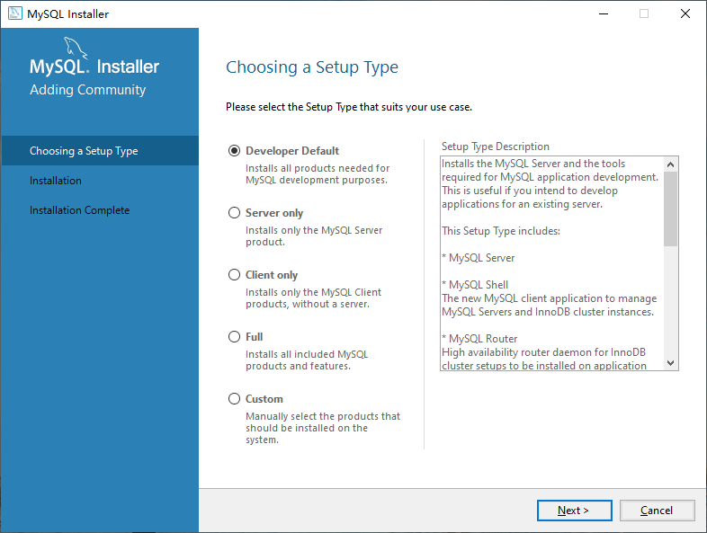
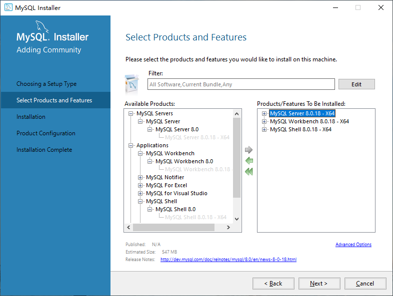
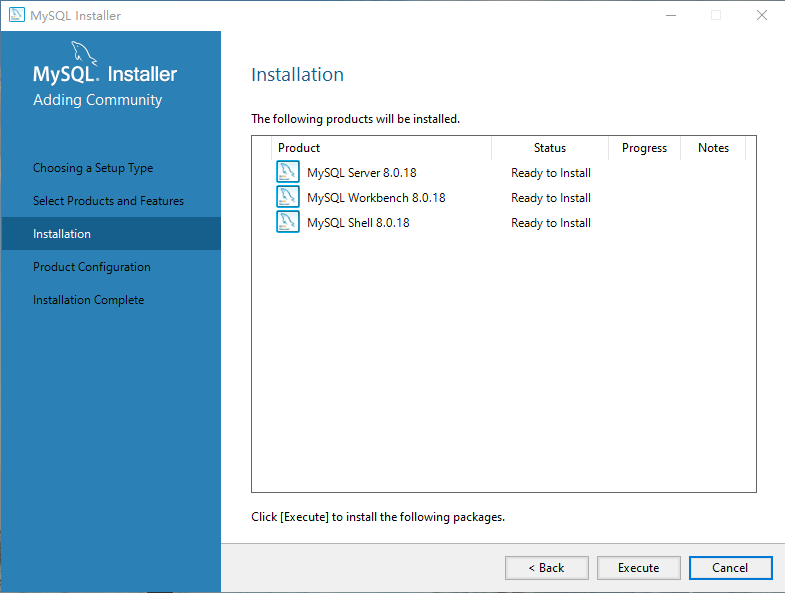
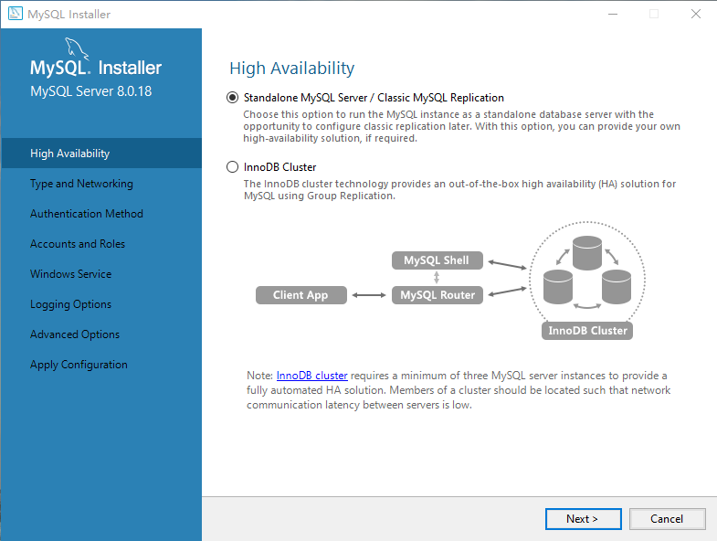
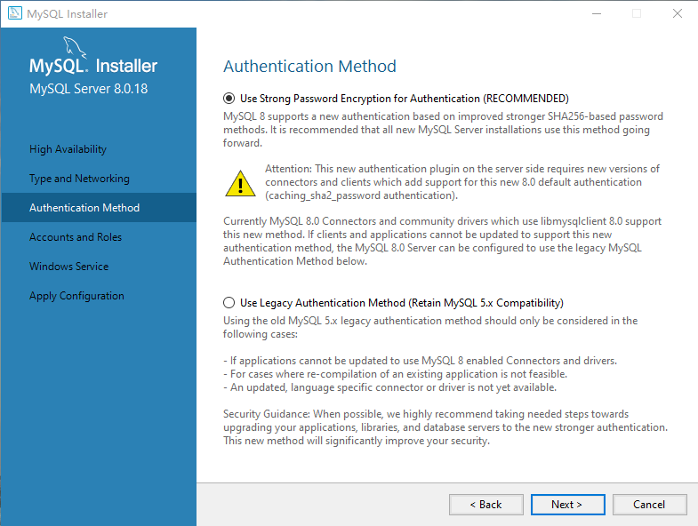
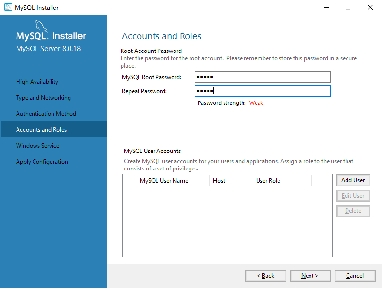
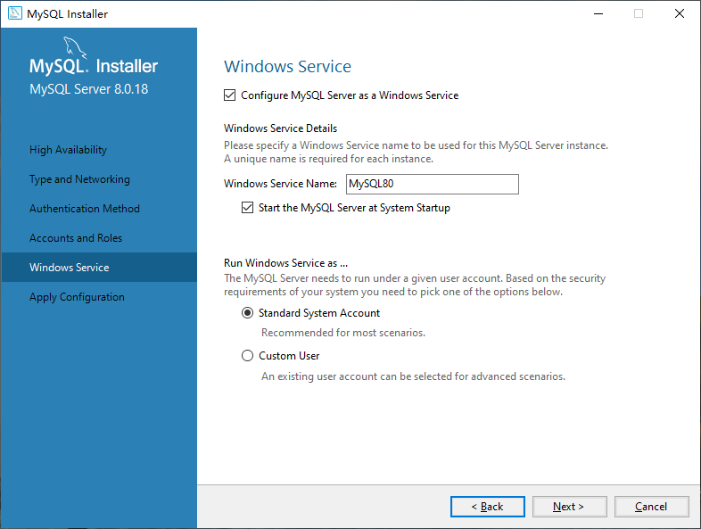
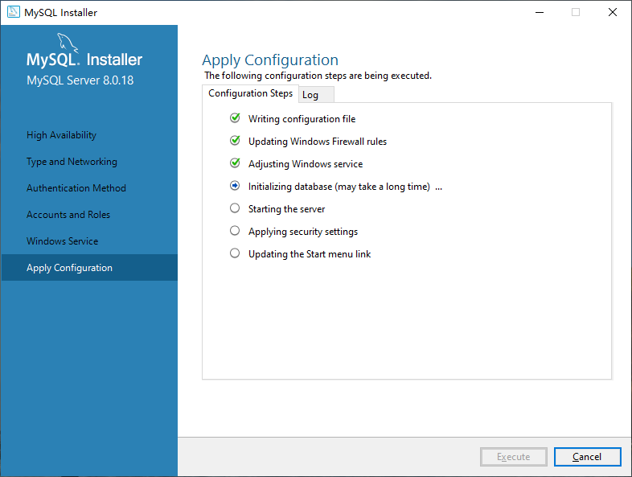
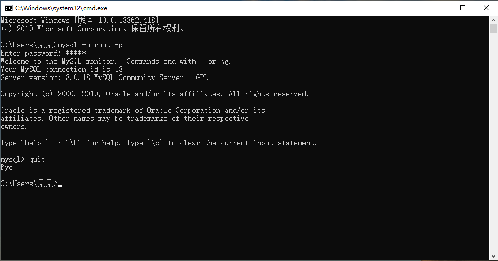

# Mysql
Mysql note
* [Mysql操作](#Mysql操作)
  - [显示数据库名](#显示数据库名)
  - [选择数据库](#选择数据库)
  - [创建数据库](#创建数据库)
  - [删除数据库](#删除数据库)
* [数据库操作](#数据库操作)
  - [查看数据库下所以表](#查看数据库下所以表)
  - [查看表](#查看表)
  - [删除表](#删除表)
  - [创建表](#创建表)
  - [修改表](#修改表)
* [记录(数据)操作](#记录(数据)操作)
    - [插入](#插入)
    - [删除](#删除)
    - [修改](#修改)
    - [查询](#查询)
* [安装](#安装)
## Mysql操作
### 打开MySQL

```
mysql -u root -p
输入密码：password
```
### 命令
help：帮助

quit：退出

### 显示数据库名
SHOW DATABASES;
### 选择数据库
USE database_name;
### 创建数据库
CREATE DATABASE database_name;
### 删除数据库
DROP DATABASE database_name;
## 数据库操作
要先选择数据库

USE database_name;
### 查看数据库下所以表
SHOW TABLES;
### 查看表
DESC table_name;

DESCRIBE table_name;

查看一列

DESCRIBE table_name column_name;
### 创建表
```
CREATE TABLE [IF NOT EXISTS] table_name(
    column_list
) engine=table_type;
```

1. IF NOT EXISTS

如果表存在，不创建

2. engine

存储引擎，默认InnoDB

3. 列结构

column_name data_type\[size] \[NOT NULL|NULL] \[DEFAULT value] \[AUTO_INCREMENT]

###### data_type

数值：int float double

字符：char 定长 varchar 不定长

>char占用定长空间，查询快

时间：data time datatime year

枚举：enum("elem1","elem2")

**自增**

AUTO_INCREMENT
###### 主键
PRIMARY KEY(key1,key2...)
### 删除表
DROP TABLE table_name;
### 修改表
ALTER TABLE table_name action;
#### 修改表名
ALTER TABLE table_name RENAME table_name_new;
#### 增加列
ALTER TABLE table_name ADD COLUMN column_list;
#### 删除列
ALTER TABLE table_name DROP COLUMN column_name;
#### 修改列
ALTER TABLE table_name CHANGE COLUMN column_name column_list;
# 记录(数据)操作
### 插入
```
INSERT INTO table_name(column1,column2...) 
vlues
    (value1,value2...),
    (value1,value2...),
    ...
    ;
```
### 删除
```
DELETE FROM table_name
where condition;
```
### 修改
```
UPDATE table_name
SET
    column_num1 = value1,
    column_num1 = value1,
    ...
WHERE condition;
```
### 查询
```
SELECT * FROM table_name WHERE condition;
```
## 安装MySQL

### 下载
Windows10下安装Mysql

[官网](https://www.mysql.com/)

[下载地址](https://dev.mysql.com/downloads/)

[安装版](https://dev.mysql.com/downloads/installer/)

### 安装

MySQL安装程序类似于VS2019,可按功能安装，也可自行选择需要的组件安装

打开下载好的Mysql安装包(mysql-installer-community-8.0.18.0.msi)

如果未运行过MySQL安装包(无MySQL安装程序)，会提示并请求安装MySQL安装程序(提示选择是)。否则，直接进入安装程序。



选项分别是：
- 开发者默认选项
- 服务器端
- 客户端
- 完整
- 定制

选择最后一项：定制



Filter可按名称，按功能分类，按版本，按位(32/64bit)限定选择范围

在Available Products选选中自己需要产品组件，点击 右箭头 添加到右侧安装目录等待安装

点击右侧的安装列表中的某一项，右下角的 Advanced Options ，可选择安装路径(每个组件都可以更改，默认在C:\Program Files\MySQL目录下)

点击 下一步 继续



点击Execute执行安装

完成后点击下一步,下一步



独立MySQL服务器/经典MySQL赋值

InnoDB集群

选择默认的第一项，下一步



使用强密码加密授权

使用传统授权方式

第一项新方式，安全，官方推荐，第二项传统方式，兼容性好

选择后，下一步



设置root用户密码

下一步



运行服务用户：

标准系统用户

自定义用户

默认选项，下一步



执行,下一步...下一步->完成安装
### 验证
cmd进入MySQL Server的bin路径

[进入数据库](#打开MySQL)

### 配置环境变量
作用：打开cmd可直接使用MySQL

参考Java环境变量配置 [淦](https://github.com/Mecoly/Java/blob/master/note/%E5%AE%89%E8%A3%85%E7%8E%AF%E5%A2%83.md#%E9%85%8D%E7%BD%AE%E7%8E%AF%E5%A2%83%E5%8F%98%E9%87%8F)

打开cmd直接登录MySQL验证


