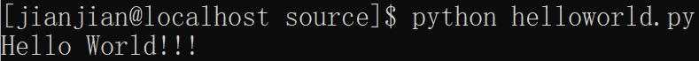

# 我的python学习笔记
[](https://www.python.org/)

[中文文档](https://docs.python.org/zh-cn/3/) [Google编程风格](https://google.github.io/styleguide/pyguide.html) [中文](GooglePythonStyleGuide.md)

## 目录
- [HelloWorld](#HelloWorld)
- [编程风格](#编程风格)
- [基础](#基础)
  * [注释](#注释)
  * [关键字](#关键字)
  * [数据类型](#数据类型)
  * [运算](#运算)
  * [条件控制](#条件控制)
  * [函数](#函数)
  * [字符串](#字符串)
  * [组合型数据类型](#组合型数据类型)
  * [面向对象](#面向对象)
  * [模块](#模块)
- [](#)

## HelloWorld
```Python
print("Hello World!!!")
```

[helloworld.py](source/helloworld.py)



## 编程风格
语言规则：
1. 代码能在pylint上运行
2. 使用`[from y ]import x[ as z]`引包
3. 使用合适的异常语句
4. 避免使用全局变量
5. 使用合适的嵌套/局部/内部类和函数
6. 创建List Dict Set使用生成器表达式
7. 使用默认迭代器和运算符
8. 
风格规则：
1. 不要使用分号终止行，不要使用分号将两个语句放同一行
2. 每行不超过80字符，
3. 谨慎使用括号
4. 缩进使用四个空格
5. 顶级函数类之间使用2空行
6. 合适的地方使用空格
7. 大部分不需要第一行`#!`，可以选择使用
8. 使用注释
9. 不需要显示继承object（除非与Python 2兼容）
10. 使用%或format()格式化字符串
11. 使用文件和套接字后关闭
12. TODO注释：待完善代码
13. 引包分行，使用`[from y ]import x[ as z]`引包
14. 一行一条语句，例外：`if foo: bar(foo)`
15. 变量访问很简单应该使用公有变量
16. 命名：避免使用不明含义的缩写
    
    避免使用
    1. 不明含义的单个字符
    2. 包或模块名的破折号
    3. Python保留名称
    4. 冒犯性名称-使用中性词

    命名约定
    1. `Internal`指只模块内可使用类
    2. `_`在模块内可使用变量、函数
    3. `__`类的私有变量函数
    4. 每个模块内有多个相关类，类和模块名避免相同产生误会
    
17. 使用主函数
18. 函数长度避免超过40行
19. 类型注释
    
## 基础
[test.py](source/test.py)
### 注释
单行注释：`#注释内容`

多行注释：`"""注释内容"""`或`'''注释内容'''`
### 关键字
命令行模式输入`help()`进入帮助，输入`keywords`查询关键字
### 基本数据类型
|类型|关键字|直接量|
|:-:|:-:|:-:|
|整数|int|0b 0o 0x 进制前缀|
|浮点数|float|e 指数|
|复数|complex|2+3j complex(2,3)|
|字符串|str|`" "`或`' '`|
|布尔值|bool|True False|
|空值|None||
### 运算
支持链式比较、赋值

算术运算：`+ - * / ** %`

逻辑运算：`not and or`

比较运算：`> < == >= <= !=`

判断：`in`元素在容器中 `is`操作数为同一对象

赋值：`= += -= *= /= **=`

### 条件控制
if-elif-else

range

for

while

assert

### 函数

### 字符串

### 组合型数据类型

### 面向对象

### 模块

## 
## 
## 
