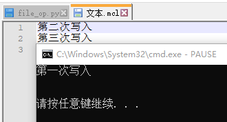

# 文件操作
包：

os 路径操作 无需安装

openpyxl Excel操作 需要安装openpyxl

* [路径操作](#路径操作)
* [文本读写](#文本读写)
* [Excel操作](#Excel操作)
* [高级操作](#高级文件操作)
## 路径操作
### 相对路径
"/"：磁盘根目录

"./"：当前目录

"../"：上级目录

### 查看绝对路径(含文件名)
os.path.abspath(path)
### 查看路径存在
os.path.exists(path)

os.path.isfile(path)

os.path.isdir(path)
### 创建路径
os.mkdir( path , mode=0o777 , * , dir_fd=None ) 
os.makedirs( name , mode=0o777 , exist_ok=False ) 
### 读取路径下文件
读取所有文件
os.listdir(path="")
## 文本读写
文件操作顺序：打开文件->读写操作->关闭文件
### 打开文件
open(file, mode='r', buffering=-1, encoding=None, errors=None, newline=None, closefd=True, opener=None)

    file:文件路径
    mode:打开模式
      'r'读取(默认) 'w'写入(截断) 'x'排它创建 'a'写入(追加) 
      'b'二进制模式 't'文本模式 '+'更新磁盘文件
    buffering:缓冲策略
      0(二进制模式)缓冲关闭 
      1(文本模式)行缓冲 
      >1指定缓冲区大小
    encoding:编码(仅文本模式)
    errors:指定处理编码错误
    newline:换行符号(仅文本)
    closefd:如果 closefd 是 False 并且给出了文件描述符而不是文件名，那么当文件关闭时，底层文件描述符将保持打开状态。如果给出文件名则 closefd 必须为 True （默认值），否则将引发错误。
    opener:可以通过传递可调用的 opener 来使用自定义开启器。然后通过使用参数（ file，flags ）调用 opener 获得文件对象的基础文件描述符。 opener 必须返回一个打开的文件描述符（使用 os.open as opener 时与传递 None 的效果相同）
### 读写操作
#### 文本模式
读：read(size=-1) readline(size=-1)

写：write(s)
### 关闭文件
close()
### 测试代码
```python
import os #文件操作
# 判断路径
if not os.path.exists("./test"):
	os.mkdir("./test")
	pass
# 写入
file_w=open("文本.mcl","w",1)
file_w.write("第一次写入\n")
file_w.close()
file_r=open("文本.mcl","r",1)
print(file_r.read())
file_r.close()
file_w=open("文本.mcl","w",1)
file_w.write("第二次写入\n")
file_w.close()
file_w=open("文本.mcl","a",1)
file_w.write("第三次写入\n")
file_w.close()
```
[源码](file_op.py)


## Excel操作
所用库：openpyxl

pip安装:pip install openpyxl

引入:

from openpyxl import Workbook

from openpyxl import load_workbook

操作顺序：新建/打开Excel文件->选项卡操作/数据操作->保存Excel文件
### Excel文件
#### 新建
wb=Workbook()
#### 打开
wb=load_workbook(file)
#### 保存
wb.save(file)
### Excel选项卡Sheet
#### 新建Sheet
wb.create_sheet(sheetname,position)

sheetname:同名选项卡后接(1,2,3...) 默认名为"Sheet"

position:插入位置,默认end
#### 查看所有Sheet
wb.sheetnames属性
#### 下标选择Sheet
ws=wb\[sheetname]
#### 修改Sheet的title
ws.title="newtitle"
#### 删除
wb.remove(worksheet) or del wb\[sheetname]

worksheet<==>wb\[sheetname]
### Excel数据
#### 单元格cell
选取wc=ws\["A2"]<==>wc=ws.cell(1,2)

	ws.cell(row,colum,value)函数
	value有参数为赋值，无参数值不变
赋值：
wc.value=newvalue
ws.cell(row,colum,value)
##### 插入图片
from openpyxl.drawing.image import Image

img = Image('logo.png')

ws.add_image(img, 'A1')
#### 按行
ws.append(\[value1,value2...])
## 高级文件操作

[Top](#文件操作)
