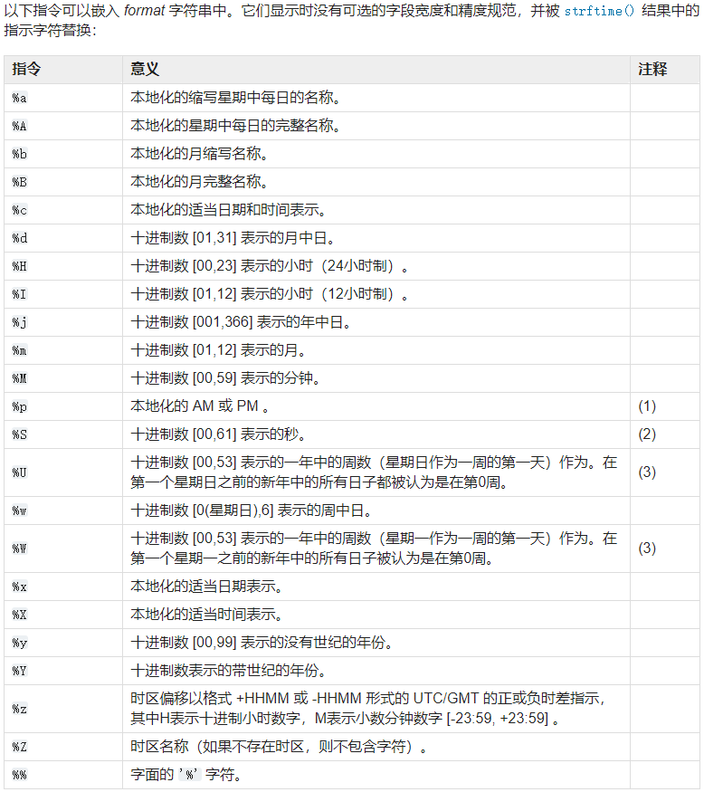

# time
包:

time 时间操作 无需下载

os 清屏 无需下载
## 获取系统时间
time.strftime(format[, t])

转换一个元组或 struct_time 表示的由 gmtime() 或 localtime() 返回的时间到由 format 参数指定的字符串

如果未提供 t ，则使用由 localtime() 返回的当前时间

time.gmtime([secs])

UTC 时间(dst=0)

time.localtime([secs])

与 gmtime() 相似但转换为当地时间

如果未提供 secs 或为 None ，则使用由 time() 返回的当前时间

当 DST 适用于给定时间时，dst标志设置为 1 

dst:[夏令时](https://baike.baidu.com/item/%E5%A4%8F%E4%BB%A4%E6%97%B6/1809579?fr=aladdin)标志
## 程序暂停
time.sleep(secs)
暂停执行调用线程达到给定的秒数。参数可以是浮点数，以指示更精确的睡眠时间

实际的暂停时间可能小于请求的时间，因为任何捕获的信号将在执行该信号的捕获例程后终止 sleep() 

此外，由于系统中其他活动的安排，暂停时间可能比请求的时间长任意量
## 程序运行时间
time.perf_counter() → float

返回性能计数器的值（以小数秒为单位），即具有最高可用分辨率的时钟，以测量短持续时间

它确实包括睡眠期间经过的时间，并且是系统范围的

返回值的参考点未定义，因此只有连续调用结果之间的差异才有效。

time.process_time() → float

返回当前进程的系统和用户CPU时间总和的值（以小数秒为单位）

它不包括睡眠期间经过的时间

根据定义，它在整个进程范围中

返回值的参考点未定义，因此只有连续调用结果之间的差异才有效

[代码](time_print.py)
