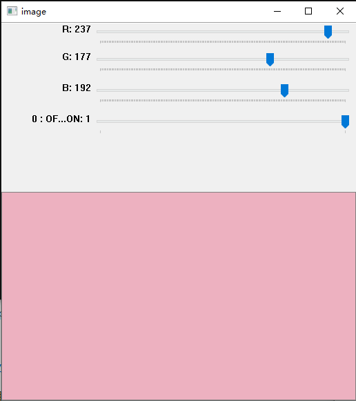
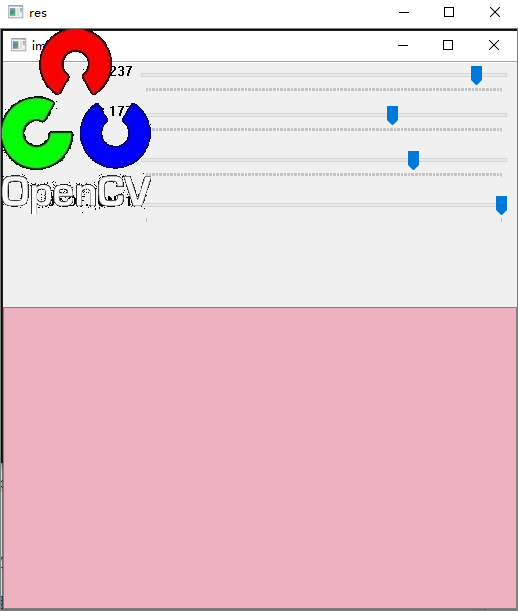

# 图像处理
包：

opencv 图像处理 需要安装

>pip install opencv-python

[文档](https://docs.opencv.org/master/d6/d00/tutorial_py_root.html)

目录：
- [图形界面](#图形界面) 
  * [图像入门](#图像入门)
  * [视频入门](#视频入门)
  * [画图功能](#画图功能)
  * [鼠标触发画图](#鼠标画图)
  * [颜色托盘的滑动条](#颜色滑动条)
- [核心操作](#核心操作)
  * [基本操作](#基本操作)
  * [算术操作](#算术操作)
  * [代码优化](#代码优化)
- [图片加工](#图片加工)

- [Feature Detection and Description]()

- [Video analysis (video module)]()

- [Camera Calibration and 3D Reconstruction]()

- [Machine Learning]()

- [Computational Photography]()

- [Object Detection (objdetect module)]()

- [OpenCV-Python Bindings]()

## 图形界面
显示、保存图片和视频，控制鼠标事件，创建滑动条
### 图像入门
目标：
  
    打开、显示、保存图片
    函数：cv.imread(), cv.imshow() , cv.imwrite()
    另外，在Matplotlib显示图片
#### OpenCV
##### 读取图片
cv.imread() 读取

参数：

    1.图片路径：相对路径或绝对路径 路径错误不报错，不显示图片
    2.读取方式属性：
      cv.IMREAD_COLOR : 彩色图片.透明的看不到.默认
      cv.IMREAD_GRAYSCALE :单通道灰度图
      cv.IMREAD_UNCHANGED :原始图，彩色打开彩色，灰色打开灰色
      值：-1，0，1
##### 显示图片
cv.imshow() 显示

参数：
    
    1.窗口名，可以多个图片，但窗口名要不同
    2.图片
      ps:默认自动调整大小

cv.waitKey(secs) 

    维持显示secs秒，直到时间到或按下键盘任意键
    secs=0：时长无限
    返回值为按下的键盘按键

cv.destroyAllWindows() 关闭

cv.namedWindow() 调整窗口大小

    第一个参数：窗口名

    第二个参数：cv.WINDOW_AUTOSIZE(默认)不可修改 cv.WINDOW_NORMAL:可修改
##### 保存图片
cv.imwrite(path,img)
#### Matplotlib
[官方文档](https://matplotlib.org/api/pyplot_api.html#matplotlib.pyplot.imshow)
### 视频入门
目标：
    
    打开、显示、保存视频
    相机获取画面并保存
    函数: cv.VideoCapture(), cv.VideoWriter()
#### 相机获取视频
##### 创建对象
cap = cv.VideoCapture(0)

创建**VideoCapture**对象,多个相机可选择>=0

cap.isOpened() 

判断是否打开 打开使用cap.open()
##### 读取
ret, frame = cap.read()

一帧一帧读

ret 读到标志(True/False)

frame 每帧

cv.cvtColor() 图片颜色转换

显示：[图片显示](#显示图片)
##### 调整大小
查看宽高：cap.get(cv.CAP_PROP_FRAME_WIDTH) cap.get(cv.CAP_PROP_FRAME_HEIGHT)

调整宽高：

ret = cap.set(cv.CAP_PROP_FRAME_WIDTH,width_int) ret = cap.set(cv.CAP_PROP_FRAME_HEIGHT,height_int)
##### 释放资源
cap.release()
#### 文件获取视频
cap = cv.VideoCapture(path)
#### 保存视频
##### 创建VideoWriter对象
cv.VideoWriter('output.avi', fourcc, 20.0, (640,  480))

参数：
  
    保存文件名
    FourCC：编码译码器
      MJPG：fourcc=cv.VideoWriter_fourcc('M','J','P','G')/cv.VideoWriter_fourcc(*'MJPG')
      windows:DIVX
      OSX: MJPG (.mp4), DIVX (.avi), X264 (.mkv)
      Fedora: DIVX, XVID, MJPG, X264, WMV1, WMV2.
    fps：每秒帧数
    尺寸：(width,height)
##### 写入
out.write(frame)
##### 释放
out.release()
### 画图功能
目标：

    几何画图
    函数： cv.line(), cv.circle() , cv.rectangle(), cv.ellipse(), cv.putText()
变量名：

    img : 图片
    point：坐标点（,）
    color : 颜色 (255,0,0) ：蓝
    thickness : 线粗 默认1 实心圆(-1)
    lineType : 线类型(线是由像素点组成的)默认8-connected 抗锯齿：cv.LINE_AA （适合画圆）
    shift：坐标位数
#### 线
img	=	cv.line(	img, pt1, pt2, color\[, thickness\[, lineType\[, shift]]]	)
#### 矩形
img	=	cv.rectangle(	img, pt1, pt2, color\[, thickness\[, lineType\[, shift]]]	)

img	=	cv.rectangle(	img, rec, color\[, thickness\[, lineType\[, shift]]]	)

rec：[Rect](https://docs.opencv.org/master/d2/d44/classcv_1_1Rect__.html#details)类型（矩形数据变量）
#### 圆
img	=	cv.circle(	img, center, radius, color\[, thickness\[, lineType\[, shift]]]	)

center：圆心

radius：半径
#### 椭圆
img	=	cv.ellipse(	img, center, axes, angle, startAngle, endAngle, color\[, thickness\[, lineType\[, shift]]]	)
img	=	cv.ellipse(	img, box, color\[, thickness\[, lineType]]	)

    axes：主轴尺寸的一半
    angle：椭圆旋转角度
    startAngle：椭圆弧的起始角
    endAngle：椭圆弧的结束角
#### 多边形
img	=	cv.polylines(	img, pts, isClosed, color\[, thickness\[, lineType\[, shift]]]	)

pts：坐标数组

isClosed：是否闭合(最后一个点和第一个点是否连线)
#### 文本
img	=	cv.putText(	img, text, org, fontFace, fontScale, color\[, thickness\[, lineType\[, bottomLeftOrigin]]]	)

org：坐标

bottomLeftOrigin：(True/False)(左下/左上)<-org
### 鼠标画图
void cv::setMouseCallback

(const String & winname, 

MouseCallback 	onMouse,

void * 	userdata = 0 

)

鼠标触发事件函数：

点击的窗口

触发的事件(函数名) 

传参
### 颜色滑动条
```python
import numpy as np
import cv2 as cv
def nothing(x):
    pass
# 创建背景
img = np.zeros((300,512,3), np.uint8)
cv.namedWindow('image')
# 创建颜色滑动条
cv.createTrackbar('R','image',0,255,nothing)
cv.createTrackbar('G','image',0,255,nothing)
cv.createTrackbar('B','image',0,255,nothing)
# 创建分支控制开关
switch = '0 : OFF \n1 : ON'
cv.createTrackbar(switch, 'image',0,1,nothing)
while(1):
    cv.imshow('image',img)
	#ESC退出
    k = cv.waitKey(1) & 0xFF
    if k == 27:
        break
    # 获得滑动条数据
    r = cv.getTrackbarPos('R','image')
    g = cv.getTrackbarPos('G','image')
    b = cv.getTrackbarPos('B','image')
    s = cv.getTrackbarPos(switch,'image')
    if s == 0:
        img[:] = 0
    else:
        img[:] = [b,g,r]
cv.destroyAllWindows()
```


## 核心操作
### 基本操作
目标：

    访问像素值
    访问图像属性
    设置目标区域
    分割图像B,G,R通道
#### 访问像素值
下标访问img\[x,y]

返回/赋值\[blue,green,red] 0-255

单个色素 选择c:(b:0,g:1,r:2)

取值

img\[x,y,c]<==>img.item(x,y,c)


赋值/改变值

img\[x,y,c]=value<==>img.itemset((x,y,c),value)
#### 访问属性

shape：返回元组(行，列，通道)

size：像素总数

dtype：图片数据类型
#### 访问图片的部分
img\[start_r:end_r,start_c:end_c]
#### 通道操作
分割：b,g,r=cv.split(img)

合并：img=cv.merge(b,g,r)

单通道：img\[:,:,c]
#### 边框
dst	=	cv.copyMakeBorder(	src, top, bottom, left, right, borderType\[, dst\[, value]]	)

    src:图片
    t,b,l,r:上下左右边界
    borderType：
### 算术操作
#### 相加
cv.add(x,y)不会溢出，超出范围为最大值

x+y 会溢出

#### 图片合成

dst	=	cv.addWeighted(	src1, alpha, src2, beta, gamma\[, dst\[, dtype]]	)

图片1，比重1，图片2，比重2，添加到每个和的量
#### 按位操作
```python
import cv2 as cv
#图片读取
img1 = cv.imread('Trackbar_Color.png')
img2 = cv.imread('blending.jpg')
# 主图的logo范围图片部分
rows,cols,channels = img2.shape
roi = img1[0:rows, 0:cols ]
# logo和取反
img2gray = cv.cvtColor(img2,cv.COLOR_BGR2GRAY)
ret, mask = cv.threshold(img2gray, 10, 255, cv.THRESH_BINARY)
mask_inv = cv.bitwise_not(mask)
# 主图logo位置扣掉
img1_bg = cv.bitwise_and(roi,roi,mask = mask_inv)
# logo图扣出
img2_fg = cv.bitwise_and(img2,img2,mask = mask)
# logo图放入主图选出部分
dst = cv.add(img1_bg,img2_fg)
# 合成部分放回原图
img1[0:rows, 0:cols ] = dst
cv.imshow('res',img1)
cv.waitKey(0)
cv.destroyAllWindows()
```


### 代码优化
[啊](https://docs.opencv.org/master/dc/d71/tutorial_py_optimization.html)
## 图片加工
不同的图片加工功能
### 改变颜色空间
### 几何变换
### 图像阈值
### 平滑图像
### 形态转换
### 图像梯度
### 边缘检测
### 图像金字塔
### 轮廓
### 直方图
### 图像转换
### 模板匹配
### 霍夫线变换
### 霍夫圆变换
### 分水岭图像分割
### 基于grabcut算法的交互式前景提取

## Feature Detection and Description


## Video analysis (video module)


## Camera Calibration and 3D Reconstruction


## Machine Learning


## Computational Photography


## Object Detection (objdetect module)


## OpenCV-Python Bindings


[Top](#图像处理)
