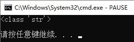
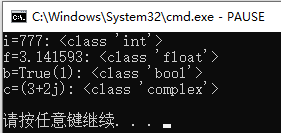
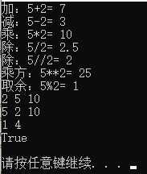
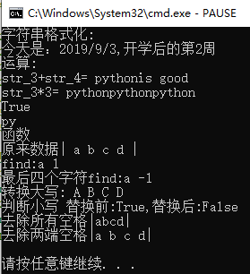
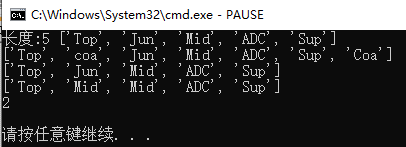
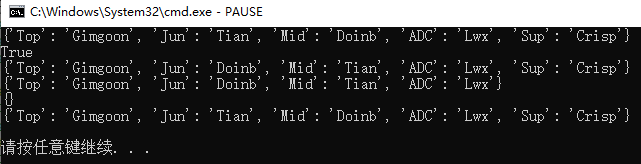
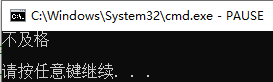
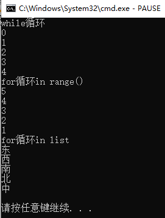
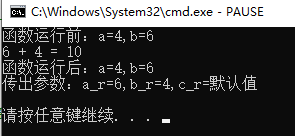

# python基础知识
[官方文档](https://docs.python.org/zh-cn/3/)

目录
- [注释](#注释)
- [变量](#变量)
- [数据类型](#数据类型)
	* [数字](#数字)
	* [字符串](#字符串)
	* [bytes](#bytes)
	* [List序列](#List序列)
	* [Dict字典](#Dict字典)
- [条件控制](#条件控制)
- [函数(方法)](#函数)
- [编码风格](#编码风格)
- [面向对象](#面向对象)
- [模块库](#模块库)

[练习](#练习)
## 注释
```python
#单行注释 npp快捷键：CTRL+Q
"""
多行注释
"""
'''
多行注释
'''
```
## 变量
在python中,变量无需声明类型，赋值时系统自动识别，未赋值使用报错

type()函数查看变量类型
```python
temp="hello world"
print(type(temp))
```


## 数据类型
### 数字
数字数据类型有：int(整型)、float(浮点型)、bool(布尔型)、complex(复数)
```python
i,f,b,c=777,3.1415926,True,3+2j
print("i=%d:"%i,type(i))
print("f=%f:"%f,type(f))
print("b=%s(%d):"%(b,b),type(b))
print("c=%s:"%c,type(c))
```


运算
```python
#算术运算
print("加：5+2=",5+2)
print("减：5-2=",5-2)
print("乘：5*2=",5*2)
print("除：5/2=",5/2)
print("除：5//2=",5//2)
print("乘方：5**2=",5**2)
print("取余：5%2=",5%2)
#赋值运算
# [1] =可多个赋值，交换值更方便
num1,num2,num3=2,5,10
print(num1,num2,num3)
num1,num2=num2,num1
print(num1,num2,num3)
# [2] "op=" op:算术运算符
num1%=2
num2**=2
print(num1,num2)
#比较运算 > >= < <= == != 可连续比较
print(1<num2<10)
```

### 字符串
定义：用(单/双)引号 str_=name="内容"

格式化：%d整型 %s字符串 %f浮点 %.2f保留小数点后两位

运算符：+连接 \*重复 \[:]索引 in/not in成员运算

函数：

* 查询 find("查询的str",start,end)后两项是查询范围，可缺省
* 替换 replace("old","new",num)num替换数量,缺省为全部
* 去除两端空格 strip()
* 大小写转换 lower() upper()
* 判断大小写 islower() isupper()
```python
#格式化
print("字符串格式化:")
str_0="2019/9/3"
str_1="今天是：%s,开学后的第%d周"
print(str_1%(str_0,2))
#运算
print("运算:")
str_3="python"
str_4="is good"
print("str_3+str_4=",str_3+str_4)
print("str_3*3=",str_3*3)
print("good" in str_4)
print(str_3[:-4])
#函数
print("函数")
str_5=" a b c d "
print("原来数据|%s|"%str_5)
print("find:a",str_5.find("a"))
print("最后四个字符find:a",str_5.find("a",-4))
print("转换大写:%s"%str_5.upper())
print("判断小写 替换前:%s,替换后:%s"%(str_5.islower(),str_5.replace("b","B").islower()))
print("去除所有空格|%s|"%str_5.replace(" ",""))
print("去除两端空格|%s|"%str_5.strip())
```

### bytes
1. 直接量 bytes = b'str'

2. 字符串
>class bytes([source[, encoding[, errors]]])

>str.encode('utf-8')

3. 转化为字符串

>str(bytes,encoding='utf-8')

>bytes.decode(encoding='utf-8')

### List序列
定义：list_name=\[item1,item2,item3]

运算符：参照字符串运算符

函数：

* 添加元素 append(item) insert(item,num)
* 删除元素 pop(num) 或使用del list_name\[num]
* 修改元素 下表索引修改
* 查看重复元素数量 count(item)
* 查看元素数量 len(list_name)
```python
#创建
list_1=["Top","Jun","Mid","ADC","Sup"]
print("长度:%d"%len(list_1),list_1)
#增
list_1.append("Coa")
list_1.insert(1,"coa")
print(list_1)
#删
del list_1[1]
list_1.pop(5)
print(list_1)
#改
list_1[1]="Mid"
print(list_1)
#查
print(list_1.count("Mid"))
```

### Dict字典
定义：dict_name={"key1":value1,"key2":value2,"key3":value3}

数组转换：
list_d=\[(item1_1,item1_2),(item2_1,item2_2),(item3_1,item3_2)]

dict_name=dict(list_d)

查询：print(key in dict)

修改：dict\[key]=new_value

删除：del dict\[key]

清空：dict.claer()

```python
# 创建
dict_1={"Top":"Gimgoon","Jun":"Tian","Mid":"Doinb","ADC":"Lwx","Sup":"Crisp"}
print(dict_1)
# 查询(key)
print("Jun" in dict_1)
# 修改(key索引修改value值)
dict_1["Jun"],dict_1["Mid"]=dict_1["Mid"],dict_1["Jun"]
print(dict_1)
# 删除(key)
del dict_1["Sup"]
print(dict_1)
# 清空
dict_1.clear()
print(dict_1)
# 数组转化
list_d=[("Top","Gimgoon"),("Jun","Tian"),("Mid","Doinb"),("ADC","Lwx"),("Sup","Crisp")]
dict_1=dict(list_d)
print(dict_1)
```

## 条件控制
### 判断
```python
sign=5
if 0<=sign<6:
	print("不及格")
	pass
elif 6<=sign<=10:
	print("及格")
	pass
else:
	print("未知数据")
	pass
```

### 循环
```python
print("while循环")
sign=0
while sign<5:
	print(sign)
	sign+=1
	pass
print("for循环in range()")
for i in range(5,0,-1):
	print(i)
	pass
print("for循环in list")
list_loop=['东','西','南','北','中']
for i in list_loop:
	print(i)
	pass
```

## 函数
```python
#1.参数 变量名即可 形参传入，不改变实参值 有默认值可不传入，使用默认值，否则必须传入
#2.返回值可有多个，也可无返回值
#3.pass 占位符，空语句 若函数内无语句必须有
def function(a,b,c="默认值"):
	a,b=b,a
	print(a,"+",b,"=",a+b)
	return a,b,c
	pass
#3.主函数
if __name__=='__main__':
	a,b=4,6
	print("函数运行前：a=%d,b=%d"%(a,b))
	a_r,b_r,c_r=function(a,b)
	print("函数运行后：a=%d,b=%d"%(a,b))
	print("传出参数：a_r=%d,b_r=%d,c_r=%s"%(a_r,b_r,c_r))
	pass
```

## 编码风格
* 使用4个空格缩进，不要使用制表符
* 换行，使一行不超过79个字符
* 使用空行分隔函数和类，以及函数内的较大的代码块
* 把注释放到单独的一行
* 使用文档字符串
* 在运算符前后和逗号后使用空格，但不能直接在括号内使用
* 命名规则：类Pascal 有意义的单词首字母大写  函数：下划线
* 编码：Python 默认的 UTF-8 或者纯 ASCII 
## 面向对象

### 格式
```
class ClassName:
    <statement-1>
    .
    .
    .
    <statement-N>
```


## 模块库
### 导入
导入模块
import module_name
导入模块中指定的类、方法
from module_name import module_element
### 库安装
pip安装

pip install module_name
### 练习
输出乘法表

1X1=1

1X2=2 2X2=4

......

[代码](基础知识.py)

[Top](#python基础知识)
