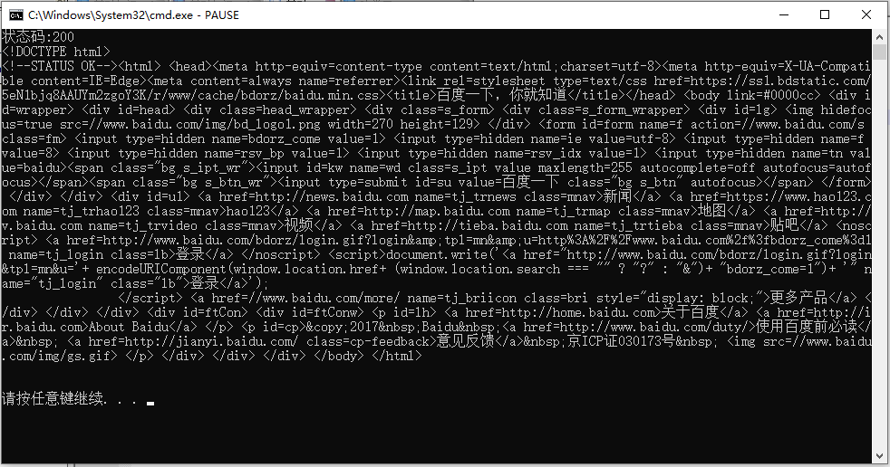

# requests
[中文文档](http://cn.python-requests.org/zh_CN/latest/)
* [安装](#安装)
* [使用](#使用)
  - [导包](#导包)
  - [获取](#获取)

* [详解](#详解)
  - [Request对象](#Request对象)
  - [request方法](#request方法)
  - [Response对象](#Response对象)
## 安装
cmd中使用pip安装

`pip install requests`
## 使用
### 导包
`import requests`
### 获取
```python
import requests
if __name__ == '__main__':
    url = 'https://www.baidu.com/' #爬取的网站地址
    r = requests.get(url) #爬取网页
    print('状态码:'+str(r.status_code)) #状态码 200表示成功
    print(r.content.decode()) #页面编码输出
    pass
```
或
```python
import requests
if __name__ == '__main__':
    url = 'https://www.baidu.com/' #爬取的网站地址
    r = requests.request('get',url) #爬取网页
    print('状态码:'+str(r.status_code)) #状态码 200表示成功
    print(r.content.decode()) #页面编码输出
    pass
```


## 详解
使用request方法，发送Request对象，返回Response对象

### Request对象

`class requests.Request(method=None, url=None, headers=None, files=None, data=None, params=None, auth=None, cookies=None, hooks=None, json=None)`

|Request属性|含义|值|
|:-:|:-:|:-:|
|method|HTTP请求类型|options head get post put patch delete|
|url|发送的url|URL|
|headers|发送的头部|字典|
|files|发送的文件|dictionary{filename: fileobject}|
|data|请求附加数据|如果提供字典，转化成form|
|params|URL parameters|字典|
|auth|身份验证|或用户名密码元组|
|cookies|附加到请求的cookie|字典|
|hooks|内部使用的回调函数|字典|
|json|files或data没指定时附加到请求|json|

### request方法
`requests.request(method, url, **kwargs)`

|Request属性|含义|值|
|:-:|:-:|:-:|
|method|Request的HTTP请求类型|options head get post put patch delete|
|url|Request的url|URL|
|headers|Request的头部|字典|
|files|Request的文件|dictionary{filename: fileobject}|
|data|Request的请求附加数据|如果提供字典，转化成form|
|params|Request的URL parameters|字典|
|auth|Request的身份验证|或用户名密码元组|
|cookies|Request的附加到请求的cookie|字典|
|json|Request的files或data没指定时附加到请求|json|
|timeout|超时|float or tuple|
|allow_redirects|允许重定向|bool|
|proxies|映射协议到代理的URL字典||
|verify|TSL证书或字符串，CA捆绑包的路径|bool|
|stream|如果是False,自动下载||
|cert|证书|如果为String，则为ssl客户端证书文件（.pem）的路径。如果是元组，（“证书”，“密钥”）配对|

### Response对象

|Response属性|含义|值|
|:-:|:-:|:-:|
|status_code|响应状态|404 200|
|content|内容|bytes|
|text|内容||
|encoding|编码||
|history|历史||
