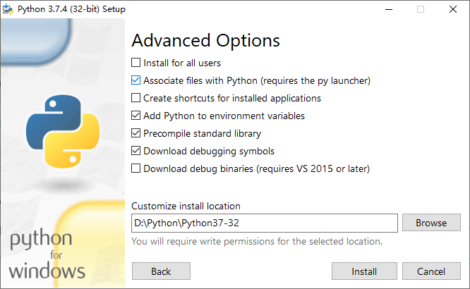

# python环境安装
[Windows10安装python环境](#Windows10安装python环境)
    
* [安装环境 安装版](#安装环境-安装版)
  - [下载](#下载安装程序)
  - [安装](#安装环境)
  - [卸载](#卸载环境)
* [配置环境 解压版](#配置环境-解压版)
  - [下载](#压缩包下载)
  - [安装](#配置环境)
  - [卸载](#删除环境)

[pip使用](#pip使用)

[notepad++运行python设置](#npp运行python设置)
## Windows10安装python环境
### 安装环境-安装版
#### 下载安装程序
[Python官网](https://www.python.org/)下载

Windows各版本：https://www.python.org/downloads/windows/

进入[python3.7.4](https://www.python.org/downloads/release/python-374/)下载页面

在页面靠下位置找到Files表格

下载[python-3.7.4win32位安装包](https://www.python.org/ftp/python/3.7.4/python-3.7.4.exe)

#### 安装环境

运行安装程序

勾选下方的Add Python to Path！！！不用再配置环境了

    如果忘记勾选，安装完成后自行配置环境变量（见下文压缩版配置过程）

选择自定义安装

    Install Now是傻瓜式安装，安装到C盘，无法修改安装路径
    Coustomize installation自定义安装，根据自己需求选择安装

全部勾选，next

    Documentation 文档

    pip 包安装工具

    IDEL tcl/tk和IDLE开发环境

    Python test suite python测试

修改安装路径：D:\Python\Python37-32

安装

    Install for all users 为所有用户安装
    Associate files with Python 关联PY后缀的文件
    Create shortcuts for installed applications 创建桌面的快捷方式
    Add Python to environment variables 添加系统变量
    Precompile standard library 安装预编译标准库(建议勾选)
    Download debugging symbols 安装调试符号（开发者建议）
    Download debug binaries 安装用于VS的调试符号(二进制)，如果不使用VS作为开发工具，则无需勾选（支持VS2015以上版本），适用于.NET开发

报错：0x80072efd -未指定错误 Precompile standard library和Download debugging symbols不要勾选了

安装完成

验证安装

win+R 打开cmd

输入python

如图：

输入3+2

结果：输出5

退出：

输入quit() 或 exit() 或 CTRL+Z，enter(回车)

#### 卸载环境
运行相应版本安装程序

点击 **Uninstall** 后立即卸载

卸载完成

### 配置环境-解压版
#### 压缩包下载
[Python官网](https://www.python.org/)下载

Windows各版本：https://www.python.org/downloads/windows/

进入[python3.7.4](https://www.python.org/downloads/release/python-374/)下载页面

在页面靠下位置找到Files表格

下载[python-3.7.4win32位压缩包](https://www.python.org/ftp/python/3.7.4/python-3.7.4-embed-win32.zip)

#### 配置环境

###### 解压到电脑

为避免不必要的麻烦，尽量避免解压到C盘，避免含有中文路径

路径：D:\Python\python-3.7.4-win32

###### 配置环境变量

右键**此电脑**->属性->高级系统设置->环境变量->系统变量中找到path->双击path或单击点编辑->新建->将上方安装路径粘贴

依次全部确定
###### 验证配置环境

win+R 打开cmd

输入python

如图：

输入3+2

结果：输出5

退出：CTRL+Z,enter(回车)

解压版使用quit()和exit()无法退出，报错未定义

#### 删除环境
直接删除解压的文件夹即可
## pip使用
    pip:查看是否安装及pip命令
    pip list:pip已安装包及版本
    pip install Package_name:安装包
    pip uninstall Package_name:卸载包
    python -m pip install --upgrade pip：更新pip版本
使用国内镜像： pip install Package_name -i url
    
    国内镜像url:
    阿里：http://mirrors.aliyun.com/pypi/simple/
    清华：https://pypi.tuna.tsinghua.edu.cn/simple/
    豆瓣：http://pypi.douban.com/simple/
   
卸载老版本的python，pip及安装过的模块不会卸载，安装新版本的python，pip会安装到旧版本python的Scripts文件夹下
# npp运行python设置
按F5 或 点击运行菜单栏下的运行

输入：

>cmd /k cd /d "$(CURRENT_DIRECTORY)" & python "$(FILE_NAME)" & ECHO. & PAUSE & EXIT

下面命令当前目录为notepad++根目录(不推荐)

>~~cmd /k python "$(FULL_CURRENT_PATH)" & ECHO. & PAUSE & EXIT~~ 

点击保存

命名为：python_run 并设置快捷键Alt+P

(Ctrl+Alt+P和网易云音乐暂停播放键位冲突)

点击运行

以后可以直接使用快捷键运行python，或点击运行菜单中的python_run运行python

[TOP](#python环境安装)
